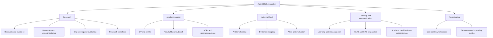

## The problem

General-purpose AI assistants are flexible, but recurring work often needs more than a good one-off prompt. Research planning, experiment design, paper writing, reproducibility checks, PhD applications, and technical learning each have different inputs, failure modes, and standards of evidence.

**Agent Skills** packages these workflows as focused, reusable instructions. Each skill defines when it should be used, what it should produce, and the checks that keep the result connected to the user's actual goal.

## What the repository provides

The repository is organised as an installable library of skills across areas including:

- research discovery, reasoning, experimentation, engineering, communication, and publishing;
- academic-career workflows such as CVs, professor fit, recommendation letters, and statements of purpose;
- industrial R&D, with workflows for problem framing, evidence mapping, pilots, and evaluation;
- learning, language-test preparation, and presentation planning;
- note-centric workspace setup for research and academic work.

The skills are grouped by purpose rather than presented as one large generic prompt. This makes it easier to select a workflow whose deliverable matches the task: for example, a claim audit, a minimal experiment design, a reproducibility review, or a research-application package check.

## Library structure

## Design principles

The project treats an agent skill as a small operational contract rather than a style guide. A useful skill should be narrow enough to activate reliably, explicit about its boundaries, and concrete about what counts as a finished result.

For research work, that means preserving the distinction between an idea, evidence, a claim, and a validated conclusion. For application and writing workflows, it means extracting reusable evidence from a profile instead of inventing a polished narrative. For coding and experimental work, it means favouring runnable checks, provenance, and decision-relevant results over decorative process.

## Why this project matters to me

This is my open-source effort to turn the working habits behind my research and engineering work into reusable tools. It combines my interests in research methodology, reproducibility, technical communication, and practical AI systems.

It also reflects a principle I care about: an AI workflow should make reasoning easier to inspect, not merely make an answer sound more confident. A skill is valuable only if it helps a user reach a result they can understand, verify, and use.

## Links

- [GitHub repository](https://github.com/jurgendn/agent-skills)
- [Installation and skill catalog](https://github.com/jurgendn/agent-skills#readme)
